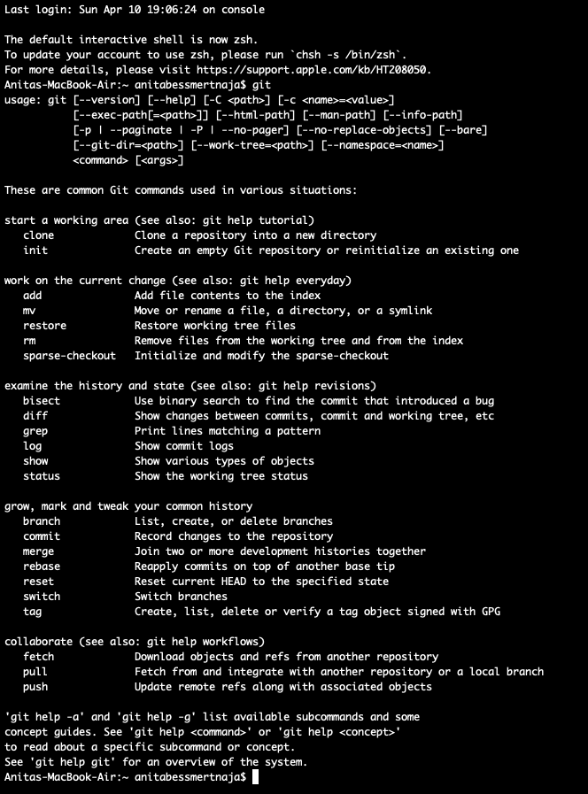
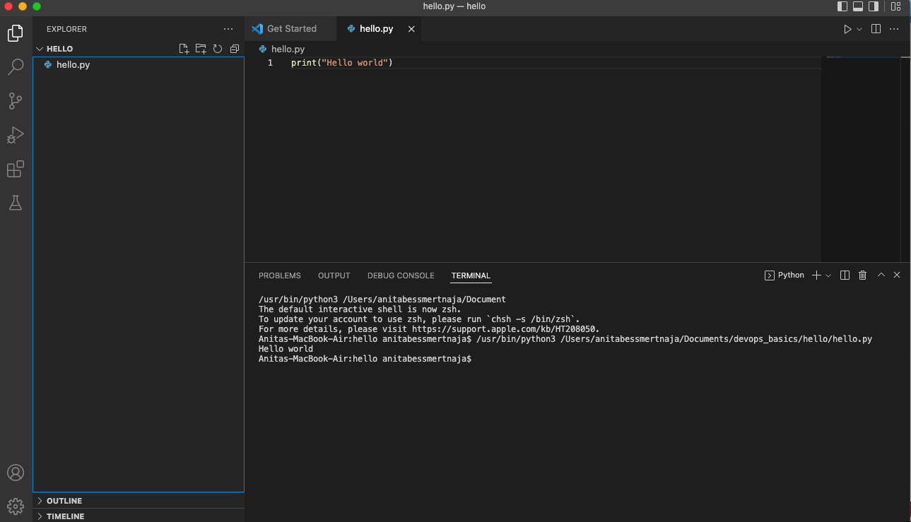

# DevOps repozitorijs

Anitas Bessmertnajas DevOps repozitorijs pamati iesācējiem

1. git repo - [Git repo](https://github.com/AnitaB21/devops_basics_anitabessmertnaja)
2. screenshot of git installation 
3. screenshot of Visual Code installation 