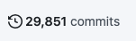

14. Jā, git redz atšķirību starp abiem failiem - piem., module_1 git.png failam hash ir af38268, bet module_2 tāds pats fails ir ar hash 55ef993.
15. Noklonēju terraform mapi no github.
16. Noklonējot terraform mapi no git, es ieeju tajā mapē caur terminālu un ar "git log" komandas palīdzību varu apskatīt izmaiņas, veiktas pēdējo nedēļu laikā. Otrais veids - ieiet pašā github platformā un apskatīt izmaiņu vēsturi, nospiežot uz 
17. Atradu, kādus commitus veica `Laura Pacilio`, izmantojot komandu:
```
git log --author="Laura Pacilio"
```
18. Jā, atradu, ka Laura veikusi commitus arī pagajušā gada septembrī, izmantojot komandu:
```
git log --author="Laura Pacilio" --since="2021-09-01" --until="2021-09-30"
```
19. Redzu, ka Laura nav veikusi commitus vakar, 26.aprīlī, izmantojot komandu:
```
git log --author="Laura Pacilio" --after="2022-04-26"
```
* Atlasīju, izmantojot komandu:
```
git log --since="2021-04-20" --until="2021-04-21"
```
Tas notiek, ja vairāki commiti ir saspiesti jeb angliski "squashed" noteiktajā zarā pirms tas ir samerdžots main zarā. Un git ņem to datumu, kas bija pirmais commits no tiem visiem, tātad nevis 21.datums, bet 16.datums.